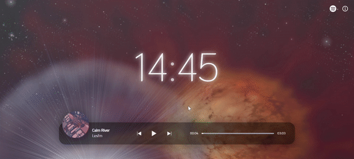

# Chill Music Player with APOD and Spotify

A simple music player made with HTML, Tailwind CSS and Vanilla JavaScript; with several additional features.

## Features

- Music player made with HTML Audio DOM + JavaScript.
- Styled with Tailwind CSS.
- Backdrop from NASA's Astronomy Picture of the Day API. (Link: https://api.nasa.gov/)
- Info section about the backdrop.
- Spotify Embed to load more songs. (Read more: https://developer.spotify.com/documentation/widgets/generate/embed/)

## Demo

https://dericored.github.io/study-companion/

  
